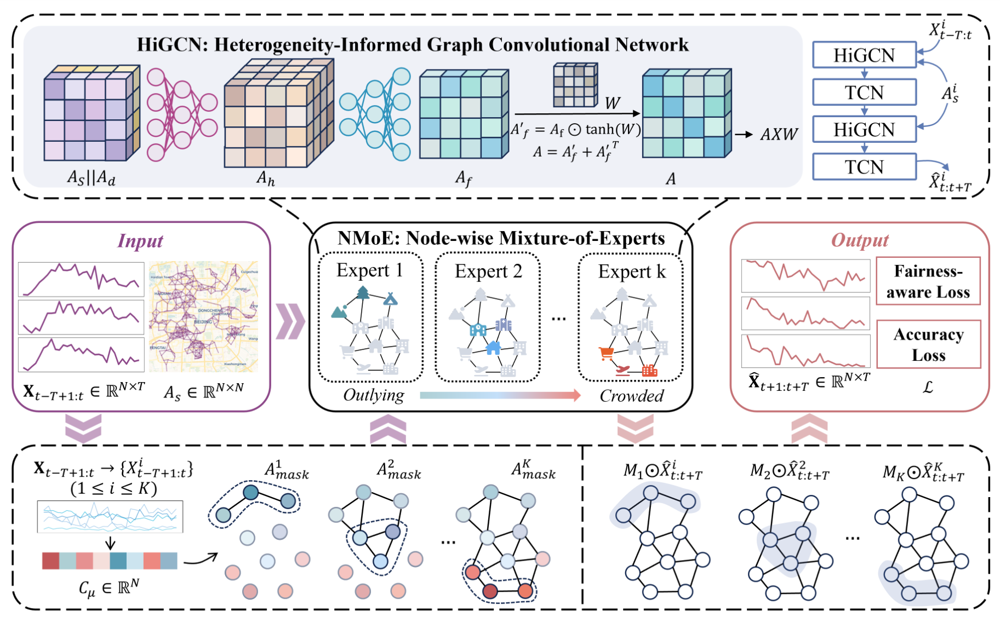

# 👋 HiMoE: Heterogeneity-Informed Mixture of Experts for Fair Spatial-Temporal Forecasting



This is an official Pytorch implementation of HiMoE.

## Environment
- python: 3.10
- numpy: 1.26
- torch: 2.0.1

## Data Preparation

We have provided [download links](https://drive.google.com/drive/folders/1vJY2eA_3dXAkWHmhrXjsCgvApTNvD2kA?usp=sharing)  for the PEMS04 and KNOWAIR datasets. However, the Beijing and TongZhou datasets cannot be made publicly available.

You need to download the data to `./data/PEMS04/` or `./data/KNOWAIR/` and follow the instructions in `./data/README.md` to initialize the datasets.

## Run Pre-trained Model
```
python main.py --conf .\conf\himoe.json --dataset PEMS04 --data_dir .\data\PEMS04\ --gpuid 0 --mode test_only --best_model_path .\exp\pems04-best.pkl

python main.py --conf .\conf\himoe.json --dataset KNOWAIR --data_dir .\data\KNOWAIR\ --gpuid 0 --mode test_only --best_model_path .\exp\knowair-best.pkl
```

## Model Training
```
python main.py --conf .\conf\himoe.json --dataset PEMS04 --data_dir .\data\PEMS04\ --gpuid 0

python main.py --conf .\conf\himoe.json --dataset KNOWAIR --data_dir .\data\KNOWAIR\ --gpuid 0
```
